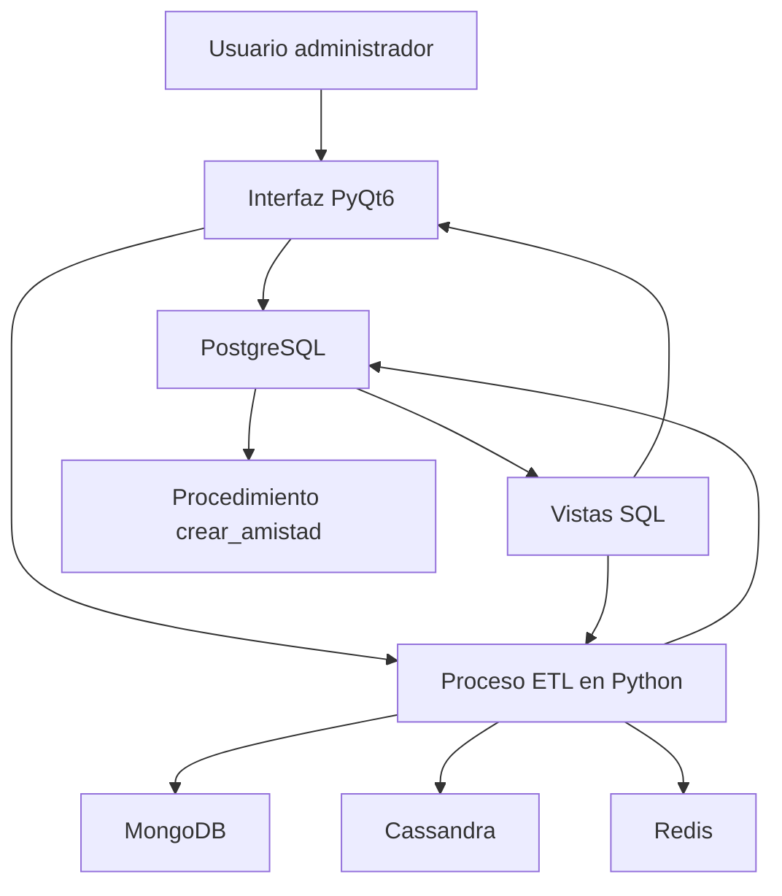

# Informe de Práctica de Base de Datos II

## Red social académica con persistencia políglota

---

## 1. Introducción

El presente informe describe el desarrollo de una red social académica implementada como práctica de la asignatura Base de Datos II. El proyecto se construyó aplicando el enfoque de **Persistencia Políglota**, el cual consiste en utilizar diferentes motores de bases de datos según la naturaleza de los datos, los patrones de consulta y las necesidades de rendimiento del sistema.

La solución integra **PostgreSQL**, **Python**, **MongoDB**, **Cassandra**, **Redis** y una interfaz gráfica desarrollada en **PyQt6**. PostgreSQL cumple el rol de base de datos relacional principal, encargada de almacenar la información normalizada y garantizar la integridad referencial. Python funciona como puente entre los diferentes sistemas de almacenamiento mediante un proceso ETL. MongoDB se emplea para almacenar publicaciones en formato documental, Cassandra para representar relaciones de amistad orientadas a consulta distribuida, Redis como mecanismo de caché para el feed de noticias y PyQt6 como capa de interacción gráfica para el usuario administrador.

El sistema modela entidades propias de una red social, tales como usuarios, publicaciones, comentarios y amistades. A partir de estas entidades se desarrollaron restricciones de integridad, procedimientos almacenados, vistas SQL, procesos de migración de datos y funcionalidades visuales que permiten administrar el flujo de información entre los distintos componentes.

Desde una perspectiva académica, esta práctica permitió aplicar conceptos fundamentales de normalización, integridad referencial, lógica de negocio en bases de datos, consultas relacionales, transformación de datos, modelos NoSQL y diseño de arquitecturas híbridas. Además, permitió comprender que no todos los datos de una aplicación deben almacenarse de la misma manera, sino que cada motor puede aportar ventajas específicas dependiendo del caso de uso.

---

## 2. Objetivos

### Objetivo general

Desarrollar una red social académica basada en una arquitectura de persistencia políglota, integrando una base de datos relacional en PostgreSQL con motores NoSQL y mecanismos de caché mediante un proceso ETL en Python y una interfaz gráfica en PyQt6.

### Objetivos específicos

- Corregir y fortalecer el modelo relacional inicial mediante llaves foráneas, restricciones de integridad y validaciones de negocio.
- Implementar una restricción `CHECK` que impida registrar amistades de un usuario consigo mismo.
- Crear un procedimiento almacenado para gestionar solicitudes de amistad evitando duplicados y relaciones inválidas.
- Construir vistas SQL para consultar solicitudes pendientes, amistades aceptadas y el feed de noticias con conteo de comentarios.
- Desarrollar un proceso ETL en Python capaz de extraer datos desde PostgreSQL, transformarlos a estructuras JSON y cargarlos en MongoDB, Cassandra y Redis.
- Utilizar Redis como sistema de caché para mejorar el acceso a información consultada frecuentemente.
- Implementar una interfaz gráfica en PyQt6 que permita ejecutar el ETL, visualizar información y consumir procedimientos almacenados desde una aplicación de escritorio.
- Analizar los beneficios de combinar bases de datos relacionales y NoSQL en términos de integridad, rendimiento, flexibilidad y escalabilidad.

---

## 3. Descripción de la problemática planteada

La problemática principal consistía en diseñar e implementar una red social académica capaz de gestionar usuarios, publicaciones, comentarios y relaciones de amistad, garantizando integridad de los datos y permitiendo consultas eficientes sobre información social.

Inicialmente, el modelo relacional contenía tablas con campos que representaban relaciones entre entidades, pero dichas relaciones no estaban completamente formalizadas mediante restricciones de base de datos. Por ejemplo, las publicaciones tenían un campo `autor_id`, los comentarios tenían referencias a usuarios y publicaciones, y las amistades tenían identificadores de usuario solicitante y receptor. Sin embargo, mientras esas referencias no se definieran como llaves foráneas, la base podía aceptar registros huérfanos o inconsistentes.

Además, una red social requiere reglas de negocio específicas. No debe ser posible que un usuario se agregue a sí mismo como amigo, ni que se creen múltiples solicitudes o amistades duplicadas entre los mismos usuarios. También se necesita consultar de forma frecuente información agregada, como solicitudes pendientes, amistades aceptadas y publicaciones con el número de comentarios asociados.

Por otra parte, el proyecto planteaba la necesidad de comparar el uso de diferentes tecnologías de persistencia. En una red social, no todas las consultas tienen la misma naturaleza. Algunas requieren consistencia e integridad transaccional, como la creación de amistades; otras se benefician de estructuras documentales, como publicaciones con comentarios; otras pueden optimizarse mediante modelos distribuidos, como relaciones entre usuarios; y algunas requieren acceso rápido, como un feed almacenado en caché.

Por estas razones, se desarrolló una solución basada en varios motores de datos, donde PostgreSQL actúa como fuente principal confiable y los demás sistemas reciben información transformada según su propósito específico.

---

## 4. Desarrollo de la solución

### Fase 1: Ingeniería y Normalización SQL

#### Problema resuelto

La primera fase abordó la corrección del modelo relacional inicial. Aunque las tablas principales ya estaban definidas, existían campos que representaban relaciones entre entidades sin tener restricciones formales. Esto podía permitir inconsistencias, como comentarios asociados a publicaciones inexistentes, publicaciones con autores no registrados o amistades entre usuarios inexistentes.

Las tablas principales del modelo son:

- `usuarios`: almacena los datos básicos de cada usuario, incluyendo nombre, correo electrónico, fecha de registro y país.
- `publicaciones`: representa los contenidos creados por los usuarios.
- `comentarios`: almacena comentarios realizados sobre publicaciones.
- `amistades`: representa la relación social entre dos usuarios, incluyendo estado y fecha.

#### Decisiones tomadas

Antes de agregar las llaves foráneas, se incluyeron sentencias de limpieza para eliminar registros huérfanos. Esta decisión es importante porque PostgreSQL no permite crear una restricción de llave foránea si ya existen datos que incumplen la regla. Por lo tanto, primero se depuraron registros de `comentarios`, `publicaciones` y `amistades` que apuntaran a identificadores inexistentes.

Posteriormente, se agregaron restricciones mediante `ALTER TABLE`, manteniendo el principio de evolución controlada del esquema. Las restricciones implementadas fueron:

- `fk_publicaciones_usuario`: relaciona `publicaciones.autor_id` con `usuarios.id_usuario`.
- `fk_comentarios_usuario`: relaciona `comentarios.usuario_id` con `usuarios.id_usuario`.
- `fk_comentarios_publicacion`: relaciona `comentarios.publicacion_id` con `publicaciones.id_publicacion`.
- `fk_amistades_solicitante`: relaciona `amistades.usuario_solicitante_id` con `usuarios.id_usuario`.
- `fk_amistades_receptor`: relaciona `amistades.usuario_receptor_id` con `usuarios.id_usuario`.

También se implementó la restricción `chk_no_autoamistad`, que evita que `usuario_solicitante_id` y `usuario_receptor_id` sean iguales. Esta regla impide registrar amistades consigo mismo desde el nivel de base de datos.

Finalmente, se creó un índice único llamado `idx_amistad_unica`, construido con `LEAST()` y `GREATEST()` sobre los dos usuarios de la relación. Esta decisión permite controlar duplicados independientemente del orden de inserción. Es decir, una relación entre los usuarios 1 y 2 se considera equivalente a una relación entre los usuarios 2 y 1.

#### Beneficios obtenidos

La fase permitió fortalecer la integridad del sistema desde la base de datos. Al implementar llaves foráneas, se garantiza que las relaciones entre usuarios, publicaciones, comentarios y amistades siempre apunten a registros válidos.

El uso de `ON DELETE RESTRICT` en relaciones hacia usuarios evita eliminar usuarios que todavía participan en publicaciones, comentarios o amistades, protegiendo la trazabilidad de la información. En el caso de comentarios asociados a publicaciones, se utilizó `ON DELETE CASCADE`, lo cual permite eliminar automáticamente los comentarios cuando una publicación es eliminada.

La restricción `CHECK` contribuye a la validez semántica del modelo, ya que una amistad consigo mismo no tiene sentido dentro de la lógica de una red social. El índice único mejora tanto la integridad como el rendimiento, porque evita duplicados y facilita la búsqueda de relaciones existentes.

En conjunto, esta fase aporta:

- Mayor consistencia de datos.
- Reducción de registros huérfanos.
- Prevención de duplicados en amistades.
- Validación automática de reglas estructurales.
- Mejor base para construir lógica de negocio confiable.

---

### Fase 2: Lógica de Negocio

#### Problema resuelto

La segunda fase se enfocó en trasladar parte de la lógica de negocio hacia PostgreSQL. En una red social, la creación de una amistad no debe ser una simple inserción directa, ya que requiere validar varias condiciones: ambos usuarios deben existir, no pueden ser el mismo usuario y no debe existir una relación previa o una solicitud pendiente entre ellos.

Además, se necesitaban consultas reutilizables para visualizar solicitudes pendientes, amistades aceptadas y el feed de publicaciones con cantidad de comentarios.

#### Decisiones tomadas

Se creó el procedimiento almacenado `crear_amistad(id1, id2)` utilizando PL/pgSQL. El procedimiento recibe dos identificadores de usuario y ejecuta las siguientes validaciones:

1. Verifica que el primer usuario exista en la tabla `usuarios`.
2. Verifica que el segundo usuario exista en la tabla `usuarios`.
3. Impide que ambos identificadores sean iguales.
4. Comprueba que no exista una amistad o solicitud previa entre ambos usuarios en ningún orden.
5. Inserta una nueva solicitud con estado `PENDIENTE`.
6. Devuelve un mensaje indicando que la solicitud fue creada correctamente.

El procedimiento utiliza excepciones para reportar errores de validación. De esta forma, la aplicación cliente no necesita duplicar toda la lógica, sino que puede delegar la regla principal a la base de datos.

También se crearon tres vistas SQL:

- `vista_solicitudes_pendientes`: muestra las solicitudes con estado `PENDIENTE`, incluyendo el nombre del solicitante y del receptor.
- `vista_amistades_consolidadas`: muestra las amistades cuyo estado es `ACEPTADA`.
- `vista_feed_noticias`: muestra publicaciones con autor, contenido, fecha, contador de likes y total de comentarios.

La vista del feed utiliza `INNER JOIN` entre publicaciones y usuarios para obtener el autor, y `LEFT JOIN` con comentarios para incluir publicaciones incluso cuando no tienen comentarios. Además, se aplica `COUNT(c.id_comentario)` y `GROUP BY` para calcular la cantidad de comentarios por publicación.

#### Beneficios obtenidos

El procedimiento almacenado centraliza reglas críticas y reduce la posibilidad de que una aplicación externa inserte datos inválidos. Esto mejora la mantenibilidad, porque cualquier cliente que ejecute `crear_amistad` se beneficia de las mismas validaciones.

Las vistas simplifican el acceso a consultas frecuentes. En lugar de escribir consultas complejas con múltiples `JOIN` cada vez que se necesita mostrar información, se consulta directamente una vista ya definida. Esto favorece la claridad, reutilización y consistencia en las respuestas del sistema.

Desde el punto de vista de integridad, la lógica de negocio complementa las restricciones estructurales de la fase anterior. Desde el punto de vista de rendimiento, las vistas organizan consultas frecuentes y permiten que PostgreSQL optimice los planes de ejecución. Además, la vista del feed sirve como fuente para el proceso de caché en Redis, lo cual conecta esta fase con la arquitectura políglota posterior.

---

### Fase 3: Arquitectura Políglota y ETL

#### Problema resuelto

La tercera fase resolvió la necesidad de trasladar información desde PostgreSQL hacia otros motores de almacenamiento especializados. La arquitectura de persistencia políglota reconoce que un sistema social puede tener diferentes necesidades de consulta:

- Datos transaccionales y normalizados.
- Documentos con información anidada.
- Relaciones orientadas a consultas distribuidas.
- Información de acceso rápido en caché.

Por esta razón, se desarrolló un proceso ETL en Python mediante el archivo `etl/etl_poliglota.py`.

#### Decisiones tomadas

Python fue seleccionado como puente políglota porque cuenta con conectores maduros para los motores utilizados en la práctica. En el proyecto se emplean las librerías `psycopg2`, `pymongo`, `cassandra-driver` y `redis`, declaradas en `requirements.txt`.

El proceso ETL se organizó en funciones independientes:

- `conectar_postgres()`: establece conexión con PostgreSQL.
- `conectar_mongo()`: conecta con MongoDB y selecciona la base `red_social_db`.
- `conectar_redis()`: conecta con Redis usando respuestas decodificadas como texto.
- `migrar_publicaciones_mongo()`: migra publicaciones y comentarios a MongoDB.
- `migrar_feed_redis()`: almacena el feed de noticias en Redis.
- `migrar_amistades_cassandra()`: crea el keyspace y tabla de amistades en Cassandra, y migra las relaciones existentes.
- `ejecutar_etl()`: coordina la ejecución general del proceso.

En MongoDB, las publicaciones se transforman a documentos JSON que contienen la publicación, su autor y una lista anidada de comentarios. Este formato se adapta mejor a consultas donde se necesita recuperar una publicación junto con sus comentarios sin realizar múltiples uniones.

En Redis, se consulta `vista_feed_noticias`, se transforma el resultado a JSON y se guarda bajo la clave `feed_noticias`. Esta decisión permite simular un patrón común en redes sociales: almacenar en caché información de lectura frecuente para reducir el costo de consultar repetidamente la base relacional.

En Cassandra, se crea el keyspace `red_social` y la tabla `amistades`, con clave primaria compuesta por `usuario_id` y `amigo_id`. Este modelo representa una estructura orientada a consultas por usuario, adecuada para escenarios distribuidos donde las relaciones sociales pueden crecer considerablemente.

#### Beneficios obtenidos

La arquitectura políglota permite que cada motor cumpla una función específica:

- PostgreSQL garantiza integridad y consistencia transaccional.
- MongoDB facilita almacenar información semiestructurada y documentos con comentarios anidados.
- Cassandra permite modelar relaciones de amistad con orientación a escalabilidad horizontal.
- Redis ofrece acceso rápido a datos previamente calculados.
- Python desacopla la extracción, transformación y carga de información.

Esta fase mejora el rendimiento porque evita que todas las consultas dependan exclusivamente de operaciones relacionales complejas. También aporta escalabilidad, ya que los datos pueden distribuirse hacia motores más adecuados para determinados patrones de lectura.

Conceptualmente, una consulta compleja de feed en PostgreSQL requiere `JOIN`, agrupaciones y conteo de comentarios. En cambio, MongoDB puede almacenar una publicación con sus comentarios en un solo documento y Redis puede devolver el feed ya preparado desde memoria. Esto no elimina la importancia de PostgreSQL, pero permite descargar ciertas operaciones de lectura hacia motores especializados.

---

### Fase 4: Interfaz Gráfica

#### Problema resuelto

La cuarta fase permitió interactuar con el sistema desde una aplicación de escritorio en lugar de depender únicamente de scripts o consultas manuales. Para ello se desarrolló una interfaz gráfica en PyQt6 ubicada en `ui/app.py`.

La aplicación permite al usuario administrador ejecutar acciones principales del sistema, como iniciar el ETL, crear amistades y visualizar el feed de noticias.

#### Decisiones tomadas

Se implementó una clase `AdminPanel` que hereda de `QWidget`. La interfaz contiene:

- Un botón para ejecutar el proceso ETL políglota.
- Un área de texto para mostrar mensajes de log.
- Dos campos de entrada para ingresar los identificadores de usuarios.
- Un botón para ejecutar el procedimiento `crear_amistad`.
- Una tabla para visualizar los resultados de `vista_feed_noticias`.
- Un botón para cargar el feed desde PostgreSQL.

La decisión de invocar el procedimiento almacenado desde la interfaz permite demostrar la integración entre la capa visual y la lógica de negocio definida en PostgreSQL. Cuando el usuario ingresa dos identificadores y presiona el botón correspondiente, la aplicación ejecuta `SELECT crear_amistad(%s,%s)` mediante `psycopg2`.

También se integró el proceso ETL llamando directamente a `ejecutar_etl()`, lo cual permite activar la migración hacia MongoDB, Redis y Cassandra desde la interfaz.

Durante la revisión técnica del proyecto se ajustó la importación del módulo `os`, necesaria para configurar correctamente la ruta de importación del paquete ETL, y se añadieron validaciones defensivas para manejar casos en los que una consulta no devuelva resultado o columnas.

#### Beneficios obtenidos

La interfaz gráfica aporta usabilidad y facilita la demostración del proyecto durante una sustentación. Permite ejecutar funcionalidades sin escribir comandos manuales y evidencia la conexión entre las capas del sistema.

Desde el punto de vista de integridad, la interfaz no inserta amistades directamente, sino que utiliza el procedimiento almacenado, respetando las reglas definidas en la base de datos. Desde el punto de vista de rendimiento, la visualización del feed se apoya en una vista SQL ya preparada. Desde la perspectiva de escalabilidad, la interfaz funciona como capa de presentación y no concentra la lógica crítica, lo cual permite que el sistema pueda evolucionar hacia otros clientes en el futuro.

---

## 5. Arquitectura General de la Solución

La arquitectura general del proyecto está compuesta por varias capas que trabajan de forma coordinada:

1. **Capa de datos relacional:** PostgreSQL almacena el modelo normalizado y aplica restricciones de integridad.
2. **Capa de lógica en base de datos:** procedimientos almacenados y vistas encapsulan reglas y consultas frecuentes.
3. **Capa de integración:** Python ejecuta el proceso ETL y conecta los diferentes motores.
4. **Capa documental:** MongoDB almacena publicaciones con comentarios en formato JSON.
5. **Capa distribuida:** Cassandra almacena relaciones de amistad en una estructura orientada a consultas por usuario.
6. **Capa de caché:** Redis conserva el feed de noticias serializado para acceso rápido.
7. **Capa de presentación:** PyQt6 ofrece una interfaz gráfica para administrar y consultar el sistema.

Diagrama general de la arquitectura:

PostgreSQL se mantiene como fuente principal de verdad. Los demás motores reciben información derivada para responder mejor a determinados escenarios de consulta. Esta separación permite combinar consistencia fuerte en el núcleo transaccional con flexibilidad y rendimiento en los modelos NoSQL.

---

## 6. Flujo de datos entre PostgreSQL, Python, MongoDB, Cassandra y Redis

El flujo de datos inicia en PostgreSQL, donde se encuentran las tablas normalizadas y las vistas SQL. A partir de esta fuente, Python realiza las operaciones de extracción, transformación y carga.

### Flujo hacia MongoDB

1. Python se conecta a PostgreSQL.
2. Consulta publicaciones junto con el nombre del autor.
3. Por cada publicación, consulta los comentarios relacionados.
4. Transforma los registros relacionales en documentos JSON.
5. Inserta los documentos en la colección `publicaciones` de MongoDB.

El documento resultante contiene campos como `id_publicacion`, `contenido`, `fecha_publicacion`, `likes`, `autor` y una lista de `comentarios`. Este diseño favorece consultas donde se desea recuperar una publicación completa con su contexto social.

### Flujo hacia Redis

1. Python consulta la vista `vista_feed_noticias` en PostgreSQL.
2. Convierte las filas obtenidas en una lista de objetos JSON.
3. Serializa la lista usando `json.dumps()`.
4. Guarda el resultado en Redis bajo la clave `feed_noticias`.

Este flujo permite que el feed sea consultado posteriormente desde memoria, reduciendo la necesidad de recalcular uniones y conteos en cada solicitud.

### Flujo hacia Cassandra

1. Python crea el keyspace `red_social` si no existe.
2. Crea la tabla `amistades` si no existe.
3. Extrae desde PostgreSQL los campos `usuario_solicitante_id`, `usuario_receptor_id` y `estado`.
4. Inserta cada relación en Cassandra usando `usuario_id` y `amigo_id` como clave primaria.

Este modelo se orienta a representar relaciones entre usuarios en un entorno preparado para crecimiento horizontal.

### Flujo desde la interfaz PyQt6

La interfaz gráfica interactúa principalmente con PostgreSQL y Python:

- Al presionar el botón de ETL, se invoca `ejecutar_etl()`.
- Al crear una amistad, se llama al procedimiento almacenado `crear_amistad(id1,id2)`.
- Al cargar el feed, se consulta `vista_feed_noticias` y se muestran los datos en una tabla.

Este flujo demuestra la integración entre capa visual, base relacional y motores complementarios.

---

## 7. Resultados obtenidos

Como resultado de la práctica se obtuvo una red social académica funcional desde el punto de vista de modelado, lógica de negocio, integración políglota e interfaz gráfica.

Los principales resultados fueron:

- Se definió un modelo relacional inicial con tablas para usuarios, publicaciones, comentarios y amistades.
- Se fortaleció la integridad referencial mediante llaves foráneas agregadas con `ALTER TABLE`.
- Se eliminó la posibilidad de autoamistades mediante la restricción `chk_no_autoamistad`.
- Se evitó la duplicidad de amistades mediante un índice único basado en `LEAST()` y `GREATEST()`.
- Se implementó el procedimiento `crear_amistad(id1,id2)` para registrar solicitudes de amistad de forma controlada.
- Se crearon vistas para solicitudes pendientes, amistades aceptadas y feed de noticias.
- Se desarrolló un ETL en Python capaz de migrar publicaciones a MongoDB, el feed a Redis y amistades a Cassandra.
- Se implementó una interfaz en PyQt6 para ejecutar el ETL, crear amistades y cargar el feed.
- Se validó la configuración de Docker Compose para PostgreSQL, MongoDB, Redis y Cassandra.
- Se verificó la compilación e importación de los módulos principales de Python.

En la revisión final del código se comprobó que `etl/etl_poliglota.py` y `ui/app.py` compilan correctamente. También se verificó que los módulos pueden importarse sin errores y que el archivo `docker/docker-compose.yml` genera una configuración válida. Al momento de la revisión, los contenedores no se encontraban en ejecución, por lo que no se ejecutó una prueba completa del ETL contra los motores activos.

---

## 8. Análisis y discusión de resultados

El proyecto evidencia que la persistencia políglota no consiste en reemplazar una base de datos por otra, sino en asignar responsabilidades según las fortalezas de cada tecnología.

PostgreSQL es adecuado para el núcleo del sistema porque permite normalización, transacciones, restricciones y consultas SQL complejas. En este proyecto, su papel es fundamental porque garantiza que la información principal sea consistente. Las llaves foráneas, restricciones `CHECK`, índices y procedimientos almacenados protegen los datos incluso si existen varios clientes conectándose a la base.

MongoDB resulta útil para representar publicaciones con comentarios anidados. Mientras que en PostgreSQL esta información requiere uniones entre `publicaciones`, `usuarios` y `comentarios`, en MongoDB puede consultarse como un documento completo. Este enfoque es conveniente para escenarios de lectura donde la publicación y sus comentarios se muestran juntos.

Cassandra aporta una perspectiva orientada a escalabilidad horizontal. Su modelo no busca reemplazar la normalización relacional, sino preparar datos para consultas específicas de alto volumen. En una red social real, las relaciones entre usuarios pueden crecer de forma significativa, por lo que un modelo distribuido puede ser útil para consultar conexiones por usuario.

Redis ofrece el mayor beneficio en datos de acceso frecuente y baja variabilidad inmediata. El feed de noticias es un buen ejemplo, porque puede calcularse desde PostgreSQL, transformarse y almacenarse temporalmente en memoria. Esto mejora el tiempo de respuesta conceptual frente a consultar repetidamente una vista con uniones y agregaciones.

La interfaz PyQt6 permite demostrar la solución de forma práctica. La creación de amistades desde la aplicación muestra que la lógica de negocio realmente se encuentra en PostgreSQL, mientras que la ejecución del ETL desde un botón demuestra la comunicación entre tecnologías.

En términos de integridad, la solución es fuerte porque las reglas principales están en PostgreSQL. En términos de rendimiento, la solución mejora al usar Redis y MongoDB para lecturas preparadas. En términos de escalabilidad, Cassandra y la separación por motores permiten imaginar una evolución hacia mayores volúmenes de datos. En términos de mantenibilidad, Python actúa como una capa clara de integración que puede modificarse sin alterar el modelo relacional principal.

Una consideración importante es que la arquitectura políglota introduce mayor complejidad operativa. Administrar varios motores requiere controlar conexiones, disponibilidad, sincronización de datos y posibles diferencias entre la fuente principal y las copias derivadas. Por ello, este enfoque es beneficioso cuando existe una justificación clara de rendimiento, consulta o escalabilidad.

---

## 9. Conclusiones

La práctica permitió desarrollar una red social académica aplicando conceptos avanzados de bases de datos relacionales y NoSQL. El proyecto inició con un modelo relacional que fue fortalecido mediante normalización, llaves foráneas, restricciones de integridad y validaciones de negocio.

La implementación del procedimiento `crear_amistad(id1,id2)` permitió controlar una operación crítica del sistema desde la base de datos, evitando usuarios inexistentes, autoamistades y relaciones duplicadas. Esto demuestra la importancia de ubicar reglas esenciales cerca de los datos.

Las vistas SQL facilitaron la consulta de información relevante para la aplicación, especialmente solicitudes pendientes, amistades consolidadas y feed de noticias. Estas vistas no solo simplifican el acceso a los datos, sino que también sirven como base para alimentar otros motores mediante el ETL.

El proceso ETL en Python permitió conectar PostgreSQL con MongoDB, Cassandra y Redis. Esta integración mostró cómo una misma información puede transformarse en diferentes modelos según el caso de uso: documentos anidados, relaciones distribuidas o datos en caché.

La interfaz gráfica en PyQt6 completó la solución al proporcionar una forma visual de ejecutar procesos y consultar información. Esto facilita la presentación del sistema y demuestra la conexión entre base de datos, lógica de negocio, ETL y capa de usuario.

En conclusión, la arquitectura políglota desarrollada cumple con los objetivos de la práctica al integrar integridad relacional, flexibilidad documental, escalabilidad distribuida y rendimiento mediante caché. La solución demuestra que el diseño adecuado de datos depende tanto de la estructura de la información como de la forma en que será consultada.
